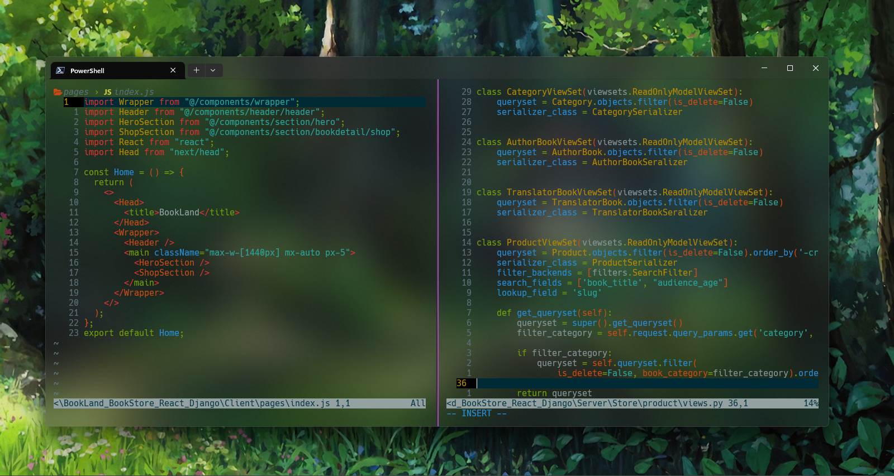

# Alirg1999 BookLand

**Warning**: This project is for developers, not set for production.

## Contents

- Client (Nextjs)
- Server (Django-DRF)

## Frontend Contents

- [Nodejs](https://nodejs.org)
- [Nextjs](https://nextjs.org/) The React Framework for the Web
- [TailwindCss](https://tailwindcss.com/) Rapidly build modern websites without ever leaving your HTML.
- [React-icons](https://react-icons.github.io/react-icons/) popular icons in your React projects easily with react-icons
- [Framer-Motion](https://www.framer.com/motion/) Framer Motion animation library for Reactjs
- [Axios](https://axios-http.com/docs/intro) Axios is a promise-based HTTP Client for node.js and the browser

## Backend Contents

- [Python](https://www.python.org/) Python is a programming language that lets you work quickly and integrate systems more effectively
- [Django](https://www.djangoproject.com/) Django makes it easier to build better web apps more quickly and with less code.
- [Django-Rest-Framework](https://www.django-rest-framework.org/) Django REST framework is a powerful and flexible toolkit for building Web APIs.
- [django-cors-headers](https://pypi.org/project/django-cors-headers/) django-cors-headers is a Django application for handling the server headers required for Cross-Origin Resource Sharing (CORS).

## Use Frontend Contents

```
yarn install
or
npm install
```

## Use Backend Contents

**Warning**: Use virtualenv.

```
pip install -r requirements.txt
```

## Code Editor

- [NeoVim](https://neovim.io/)
- [My confing neovim](https://github.com/alirg-1999/config-neovim-me.git)
